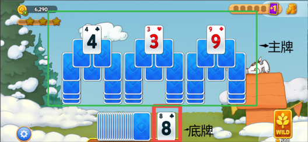
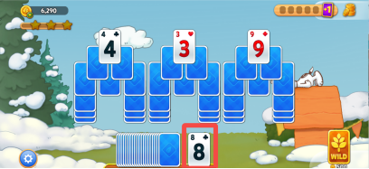
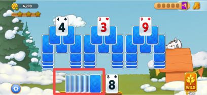
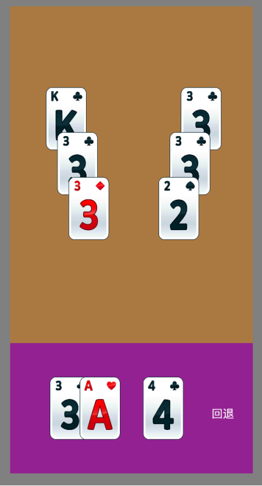

纸牌程序设计【需求一】 4-1
一、需求概述
1. 主玩法基础逻辑
初始有一张底牌，需要与主牌区的牌匹配消除 

2. 区域分布

纸牌区
	•主牌堆：
￮主游戏区域显示待消除的牌面
￮所有纸牌呈现翻开或覆盖状态，翻开的牌可直接操作，覆盖状态需消除上方牌后才能翻开。

	
	•底牌堆：
￮用于接收符合规则的纸牌（数字比当前牌面数字大或小1）。
￮初始底牌为一张翻开的备用牌。

	
	•备用牌堆：
￮玩家可从备用牌堆抽取新牌补充底牌堆，直到备用牌耗尽。

	
3. 消除规则
消除规则	截图视频	备注
1.选择主牌堆中翻开的纸牌，点击主牌堆中的牌和底牌匹配
￮数字必须比底牌数字大或小1。
￮如底牌为“8”，可匹配“7”或“9”。
2.纸牌消除无花色限制。
3.当主牌堆中无可匹配消除的纸牌时，玩家可以从备用牌翻张新牌。	
	[完整游戏操作.mp4]
完整游戏过程
	
二、任务实现需求
实现一个简单普通点击匹配以及回退功能；

1. 需求
1.需求1：手牌区翻牌替换
•点击手牌区♥A，♥A会平移（简单MoveTo）到手牌区的顶部牌（♣4）并替换它作为新的顶部牌
2.需求2：桌面牌和手牌区顶部牌匹配
•点击桌面牌的♦️3，卡牌会和手牌区顶部的♣4进行匹配【桌面牌区的牌只要和手牌区顶部牌点数差1就可以匹配，无花色要求】，点击的桌面牌（♦️3）会平移到手牌区的顶部牌（♣4）并替换它作为新的手牌区的顶部牌
3.需求3：回退功能
场景：点击♦️3 -> 点击♥A -> 点击♠2 后；连续多次点击 回退按钮 ，各卡牌需要反着平移（简单MoveTo）到原位置；直到无回退记录可回退；
2. 开发环境及要求
1.开发环境：cocos2dx 3.17
2.要求：
￮代码结构请借鉴并尽可能遵循程 三、序设计架构要求；达到代码结构可维护性和可扩展性。
￮如有程序设计文档交付更好；在文档里能将清楚在你的代码结构下未来怎么新加一个卡牌和一个新类型的回退功能是加分项
￮代码结构和程序文档的更好的交付决定未来可以承接的需求量
3. 细节说明以及资源文件
1.设计分辨率：1080*2080；窗口大小 1080*2080
Plain Text
glview = GLViewImpl::createWithRect("Test", cocos2d::Rect(0, 0, 1080, 2080), 0.5);
glview->setDesignResolutionSize(1080, 2080, ResolutionPolicy::FIXED_WIDTH);
2.主牌区和卡堆尺寸
￮主牌区尺寸：1080*1500
￮堆牌去尺寸: 1080*580
3.关卡配置文件
Plain Text
{
    "Playfield": [
        {
            "CardFace": 12,
            "CardSuit": 0,
            "Position": {"x": 250, "y": 1000}
        },
        {
            "CardFace": 2,
            "CardSuit": 0,
            "Position": {"x": 300, "y": 800}
        },
        {
            "CardFace": 2,
            "CardSuit": 1,
            "Position": {"x": 350, "y": 600
            }
        },
        {
            "CardFace": 2,
            "CardSuit": 0,
            "Position": {"x": 850, "y": 1000}
        },
        {
            "CardFace": 2,
            "CardSuit": 0,
            "Position": {"x": 800, "y": 800}
        },
        {
            "CardFace": 1,
            "CardSuit": 3,
            "Position": {"x": 750, "y": 600}
        }
    ],
    "Stack": [
        {
            "CardFace": 2,
            "CardSuit": 0,
            "Position": {"x": 0, "y": 0}
        },
        {
            "CardFace": 0,
            "CardSuit": 2,
            "Position": {"x": 0, "y": 0}
        },
        {
            "CardFace": 3,
            "CardSuit": 0,
            "Position": {"x": 0, "y": 0}
        }
    ]
}

thrift
// 花色类型
enum CardSuitType
{
    CST_NONE = -1,
    CST_CLUBS,      // 梅花
    CST_DIAMONDS,   // 方块
    CST_HEARTS,     // 红桃
    CST_SPADES,     // 黑桃
    CST_NUM_CARD_SUIT_TYPES
};

// 正面类型
enum CardFaceType
{
    CFT_NONE = -1,
    CFT_ACE,
    CFT_TWO,
    CFT_THREE,
    CFT_FOUR,
    CFT_FIVE,
    CFT_SIX,
    CFT_SEVEN,
    CFT_EIGHT,
    CFT_NINE,
    CFT_TEN,
    CFT_JACK,
    CFT_QUEEN,
    CFT_KING,
    CFT_NUM_CARD_FACE_TYPES
};
4.图片资源文件
[res.zip]
三、程序设计架构要求
架构概述
采用MVC架构，将视图、逻辑和数据分离，要求代码的可维护性和可扩展性。
1. 目录结构
python
Classes/
├── configs/    # 所有静态配置相关类
├── models/    # 运行时动态数据模型
├── views/     # 视图层，包含所有的UI展示组件
├── controllers/  # 控制器层，协调模型和视图
├── managers/  # 管理器层，提供全局性的服务和功能（作为controllers的成员；可持有model数据，禁止单例）
├── services/  # 服务层,提供无状态的服务，处理业务逻辑，不管理数据生命周期；（禁止持有model数据，可单例可静态方法）
└── utils/  # 工具类，提供通用功能
1.configs/ - 静态配置相关类
职责和边界：
所有静态配置相关类;
举例：
￮关卡配置
▪ configs/models/LevelConfig.h      关卡配置类
▪configs/loaders/LevelConfigLoader.h    配置加载逻辑
￮卡牌ui资源配置
▪configs/models/CardResConfig.h 
2.models/ - 数据模型层，包含游戏的核心数据结构
职责和边界：
运行时动态数据模型层；存储游戏数据和状态
举例：
￮CardModel 卡牌
￮GameModel 游戏
￮UndoModel 回退数据
3.views/ - 视图层，包含所有的UI展示组件
职责和边界：
视图层只负责显示和接收用户输入，不包含业务逻辑
举例：
￮CardView  卡牌
￮GameView 游戏
4.controllers/ - 控制器层，协调模型和视图
•职责和边界:
￮控制器层处理用户操作和业务逻辑，连接视图和模型
•举例
￮GameController 管理整个游戏流程
￮CardController 处理卡片相关的具体逻辑
•Controllers 可能会依赖多个 Services 和Managers
5.managers/ -管理器层
•职责和边界:
￮主要作为controller的成员变量
￮可持有model数据并对model数据进行加工
￮禁止实现为单例模式
￮禁止反向依赖controller(维护性差，也不便单元测试)
￮与其他模块的交互可以通过回调接口来实现
￮可以提供全局性的服务和功能
•举例:
￮UndoManager - 处理撤销功能
6.services/ -服务层
•职责和边界:
￮提供无状态的服务，处理业务逻辑，不管理数据生命周期【不持有数据】，而是通过参数操作数据或返回数据
▪可引用传参修改原始数据（Model）性能高
▪可返回值为数据（如Model）赋值给调用方 性能低
￮实现可复用的通用功能
￮处理跨多个控制器的共享功能
•举例:
￮GameModelFromLevelGenerator 
▪将静态配置（LevelConfig）转换为动态运行时数据（GameModel），并处理卡牌随机生成策略等等
•Services不依赖 Controllers，而是提供基础服务
7.utils/ - 工具类，提供通用功能
2. 组件间通信流程
1. 用户UI交互流程
1.用户点击UI元素：
￮用户点击卡片等UI元素时，首先由View层（如CardView）捕获事件
2.View到Controller的事件传递：
￮回调函数：Controller在初始化时向View注册回调函数，View触发回调通知Controller
3.Controller处理业务逻辑：
￮GameController或CardController接收到事件后，执行相应的业务逻辑
￮在处理前，Controller可能会更新UndoModel（通过UndoService向UndoModel插入一条回滚记录数据）
￮处理逻辑结束后，Controller更新Model的状态
4.Controller更新View：
￮逻辑处理完成后，Controller调用View对应的动画接口
￮例如，GameController调用GameView的playMatchAnimation匹配动画
Plain Text
bool GameController::handleCardClick(int cardId){
    if (!_gameModel) return false;
    //一些逻辑规则判断
    ...
    if (_gameView) {
        _gameView->playMatchAnimation(cardId);
    }
    ...
    return true;
}
1.1 典型交互案例：点击卡片
Plain Text
用户点击桌面上的卡片
        ↓
PlayFieldView的触摸事件监听器检测到点击
        ↓
PlayFieldView调用_onCardClickCallback(cardId)回调函数
        ↓
PlayFieldController::handleCardClick(cardId)处理点击事件:
检查卡片是否满足移动条件
        ↓
如果满足条件
        ↓
PlayFieldController::replaceTrayWithPlayFieldCard执行:
- 记录撤销操作
- 更新model数据
- 调用相应的vieww执行动画
2. 游戏初始化加载
c++
用户选择关卡（提供关卡ID,捕获关卡选择事件）
        ↓
调用GameController::startGame(levelId)
        ↓
GameController调用LevelConfigLoader::loadLevelConfig(levelId)获取LevelConfig
        ↓
GameController使用GameModelFromLevelGenerator::generateGameModel生成GameModel
        ↓
GameController初始化各子控制器:
PlayFieldController::init(...)
StackController::init(...)
UndoManager::init(...)
        ↓
创建GameView并添加到父节点:
gameView = GameView::create(...)
        ↓
初始化各子控制器的视图:
StackController::initView(...)
PlayFieldController::initView(...)
        ↓
GameView初始化UI:
设置初始布局
        ↓
播放入场动画:...
四、编码规范
命名规范
•类名和文件名：大写字母开头
•函数名和变量名：采用驼峰风格（小写字母开头）
•类的私有成员和方法：以 _ 下划线开头
•常量变量名：以小写字母 k 开头
代码质量要求
•每个类必须在声明处添加类的注释，清晰描述类的功能、职责和使用场景
•类的成员变量和公共方法必须添加规范的注释，说明其用途、参数和返回值
•当函数代码超过50行；请重构。
•当类代码超过500行；请重构。
•模块职责明确，遵循单一职责原则；要求代码的可维护性和可扩展性
各模块具体规范
models层
•数据层，不包含复杂的业务逻辑
•支持序列化和反序列化（因为游戏支持存档恢复继续玩）
views层
•UI视图层，负责界面展示
•可持有const类型的controller指针和const类型的model指针
•与其他模块的交互可以通过回调接口来实现
controllers层
•主要协调model和view之间的交互
•处理用户操作的业务逻辑
managers层
•主要作为controller的成员变量
•可持有model数据并对model数据进行加工
•禁止实现为单例模式
•禁止反向依赖controller(维护性差，也不便单元测试)
•与其他模块的交互可以通过回调接口来实现
•可以提供全局性的服务和功能
services层
•处理业务逻辑，不管理数据生命周期
•自身禁止持有数据，但可加工数据
•可以实现为单例或者提供静态方法
utils层
•提供通用独立的辅助功能
•不涉及业务逻辑，完全独立